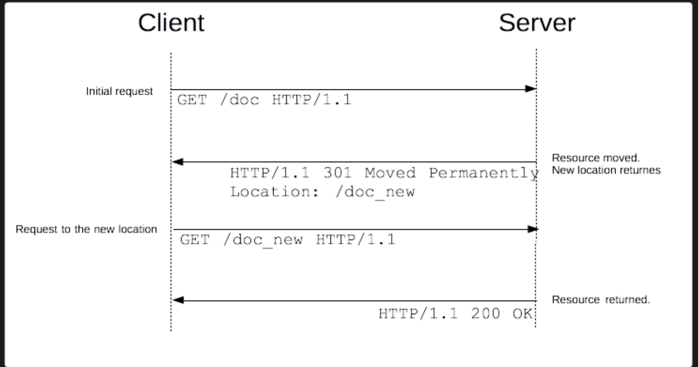

# 20220624

### 시간대별 정리

<details>
<summary>시간대별 정리</summary>

### 아침

oauth: express - react 구성

### 오전

oauth 흐름 이해하기

oauth: express - react 구성

### 오후

atom 어떻게 분리해야하는지

- 데이터 요청 처리

무신사 컴퍼니데이

refresh token작동방식이해

### 저녁

- pr구경
</details>
<br>

# 코드스쿼드

### OAuth 구현 및 이해

드디어 OAuth를 이해(?)했다. 이전에 백앤드와 프론트엔드사이에서 redirect하는 부분을 이해하지 못했다.

github를 예로 들면, `GET https://github.com/login/oauth/authorize?client_id=something` 로 요청을 해야 `github 인증페이지`로 넘어간다. 이 때, 프론트엔드가 바로 href로 요청한다면 간단하지만, 나는 `GET /api/login/oauth/github`로 요청을 보내서 서버에서 redirect를 시켜주길 바랬다.

**httpStatus(300) & Redirect**

> 302로 응답하는 경우에 자동으로 리다이렉트 요청을 하게 되는데, 백엔드 url과 github url이 다르므로 CORS에 의해 외부 리다이렉트가 막힘
> 그래서 그냥 200으로 응답하고, body에 리다이렉트 url을 담아서 전달하면 프론트엔드에서 재 요청을 하는 식으로 구현한다.

redirect로 서버api에서 브라우저를 이동시키려고할 때 (**request external redirect)** Cors문제가 발생했다. httpStatus(300)이 rediect인데, 브라우저에서 확인해보면 `status가 200`인 걸 확인했다. mdn을 확인해보니 아래그림처럼 2번의 요청이 이뤄지는 걸 확인했다.

→ `실제 이동은 브라우저가 시켜준다!`



위와 같은 문제를 해결하기위해 href에 `https://github.com/login/oauth/authorize?client_id=something` 주소를 삽입하거나, api요청으로 해당 url을 받아서 이동시키는 로직을 고려했다.

**href vs fetch**

api요청을 fetch로하는데 동작방식에 대해 제대로 이해해본적이 없는데 주말에 다시 공부해봐야겠다.

`브라우저가 해주는게 아니라 코드상에서 일어나는 일`

href ⇒ 브라우저가 이동

ajax ⇒ 브라우저가 아니라 코드에서 일어나는 일

### access token과 refresh token을 활용한 로그인 유지

- 프론트에서 만료시간을 체크하지 않음.
- api요청을 보낼 때 access token이 헤더에 알아서 포함돼서 들어가면,

서버에서 인증여부를 확인해서 통과하면 api요청을 잘 수행하고

통과하지 `특정 상태코드`로 안됐다고 반환하는데

이 안된요청을 잡아서 `GET: /api/auth/token`에 보냄 (이 때는 header의 bearer에 accesstoekn이 아니라 refresh token을 담아서 보내줘야한다)

refresh토큰도 만료된다면, 해당하는 error가 올텐데 그럼 다시 로그인 시키면 된다.

`이렇게 되면 둘다 있는 상태가 아닌가?`

`refresh토큰을 쿠키에 두고,`

`access 토큰은 ?`

a, r → cookie

- api/logout

```

```
