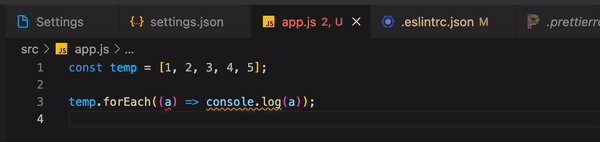
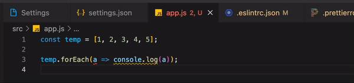

# Eslint & Prettier

# Eslint

---

> 코드 퀄리티 향상  
> 핵심적인 키워드만 익히고 자세한 설정은 필요할 때마다 익히기

ESLint는 ECMAScript/JavaScript 코드에서 발견된 패턴을 식별하고 보고하는 도구로, 코드의 일관성을 높이고 버그를 방지하는 것을 목표로 한다.

ESLint는 스타일 가이드를 좀 더 편리하게 적용하기 위해 사용하기도 하는데, 외부에 공개되어 많은 개발자가 사용 중인 [Airbnb Style Guide](https://github.com/airbnb/javascript), [Google Style Guide](https://github.com/google/eslint-config-google) 등이 있다.

```json
{
  "extends": "eslint:recommended",
  "env": {
    "browser": true,
    "node": true,
    "es6": true
  },
  "rules": {
    // "off" or 0 - turn the rule off
    // "warn" or 1 - turn the rule on as a warning (doesn’t affect exit code)
    // "error" or 2 - turn the rule on as an error (exit code is 1 when triggered)
    "no-console": 0,
    "indent": ["warning", 2]
  }
}
```

- `env` : 사용 환경을 의미
- `extends` : 사용할 확장 기능에 대해 명시하는 부분. 보통 airbnb-base나 prettier를 추가가능
- `parserOptions` : 버전과 모듈 사용 여부
- `plugins` : 사용되는 플러그인.
- `rules` : 세부 설정. 여기에 자신만의 규칙을 추가

### ESLint Rules

- 공식 사이트에 게재된 Rule들을 사용하기 위해서는 `"extends"` 에 `eslint:recommended` 속성이 추가되어 있어야 한다.

### npm 라이브러리

- `eslint` : 코드의 문법을 검사하는 린팅과 코드의 스타일을 잡아주는 포맷팅 기능

- `eslint-config-airbnb` : airbnb 코딩규칙을 사용(리액트 코딩규칙 포함)
- `eslint-config-airbnb-base` airbnb 코딩규칙을 사용(리액트 코딩규칙 포함하지 않음)

- `eslint-plugin-import` : ES2015+의 import/export 구문을 지원하도록 함

# Prettier

---

> 코드 포매터(일정한 형태로 통일)

Prettier is an opinionated code formatter

```json
{
  "arrowParens": "avoid", // 화살표 함수 괄호 사용 방식
  "trailingComma": "es5", // 여러 줄을 사용할 때, 후행 콤마 사용 방식
  "singleQuote": true, // 세미콜론 사용 여부
  "printWidth": 120, //  줄 바꿈 할 폭 길이
  "tabWidth": 2 // 탭 너비
}
```

### 설정

사용하는 에디터에 따른 설정이 필요하다.

### npm 라이브러리

- `prettier` : 코드의 스타일을 잡아주는 포맷팅 기능

# Eslint + Prettier 설정

---

린트는 자바스크립트 문법을 검사하고, 코드 포맷팅은 프리티어가 맡게한다. ESLint가 프린티어의 형식에 맞춰 린팅할 수 있도록 하기

eslint와 prettier를 같이 사용하려면 아래에 써있는 npm 라이브러리가 필요하다.

뒤에 오는 설정이 앞을 덮어쓰기때문에 꼭 prettier가 뒤로 와야 한다.

```json
{
  "extends": ["some-other-config-you-use", "plugin:prettier/recommended"]
}
// Exactly what does plugin:prettier/recommended do? Well, this is what it expands to:
// {
//  "extends": ["prettier"],
//  "plugins": ["prettier"],
//  "rules": {
//    "prettier/prettier": "error",
//    "arrow-body-style": "off",
//    "prefer-arrow-callback": "off"
//  }
//}
```

npm 라이브러리

- `eslint-config-prettier` : prettier와 충돌을 일으키는 ESLint 규칙들을 비활성화 시키는 config
- `eslint-plugin-prettier` : Prettier에서 인식하는 코드상의 포맷 오류를 ESLint 오류로 출력

## 🤔 문제

---

### prettier와 eslint 설정의 충돌문제

> 💡 Rules는 위에 extends를 덮는다.

arrowParens가 prettier에는 awalys로 되어 있고, eslint에는 error로 되어 있어 아래와 같이 prettier가 자동으로 수정하면 eslint 규칙에 걸리는 에러가 발생



### app.js

```javascript
const temp = [1, 2, 3, 4, 5];
temp.forEach((a) => console.log(a));
```

### eslintrc.json

```json
{
  "extends": ["airbnb-base", "plugin:prettier/recommended"],
  "rules": {
    "arrow-parens": ["error", "as-needed"] // a => {}
  }
}
```

### .prettierrc

```json
{
  "arrowParens": "always"
}
```

### 해결방법1

prettier설정과 eslint rules를 맞추기

- .prettierc의 aroowparns를
  avoid로 수정
- eslint에서 error 설정이 되어 있어 prettier설정대로 고쳐지긴 하지만 eslint rules에 걸림



### .prettierrc

```json
{
  "arrowParens": "aviod"
}
```

### 해결방법2

> eslint rulse 설정 변경

rules 위에 plugins, extends를 덮음 → 무조건 rules가 최우선으로 적용됨.

`eslint-config-prettier` 으로 prettier와 eslint 충돌 문제를 해결했지만 rules에서 세부적인 옵션 설정을 따로 해서 다시 충돌 문제가 발생했던 것임

처음에 했던 `"arrow-parens": ["error", "as-needed"] // a => {}` 가 아닌 아래 예시처럼 `plugin:prettier/recommended` rule을 수정하기

### eslintrc.json

```json
"rules": {
    "prettier/prettier": ["error", { "singleQuote": true, "parser": "flow", "arrowParens": "avoid" }]
  }
```

### 🔍 참고자료

### eslint

- [https://eslint.org](https://eslint.org)

- [https://tech.kakao.com/2019/12/05/make-better-use-of-eslint/](https://tech.kakao.com/2019/12/05/make-better-use-of-eslint/)

- [https://jinhyukoo.github.io/web/2021/06/21/](https://jinhyukoo.github.io/web/2021/06/21/)프로젝트환경설정2.html

- [https://rexiann.github.io/2020/12/13/what-is-eslint.html](https://rexiann.github.io/2020/12/13/what-is-eslint.html)

### prettier

- [https://prettier.io/docs/en/install.html](https://prettier.io/docs/en/install.html)

연결

- [https://poiemaweb.com/eslint](https://poiemaweb.com/eslint)

- [https://github.com/prettier/eslint-plugin-prettier](https://github.com/prettier/eslint-plugin-prettier)

- [https://github.com/prettier/eslint-config-prettier](https://github.com/prettier/eslint-config-prettier)
