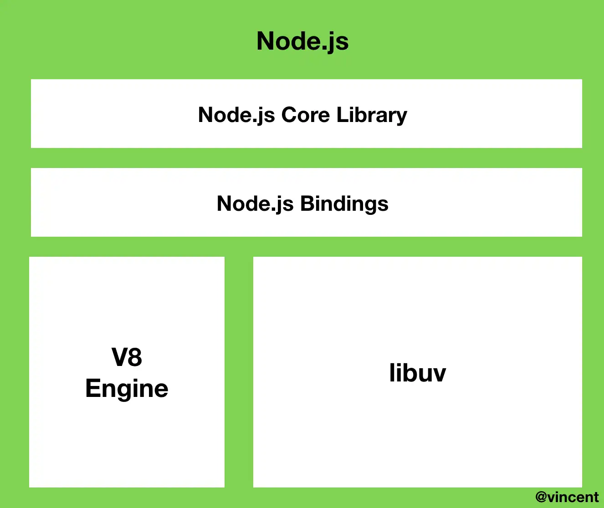
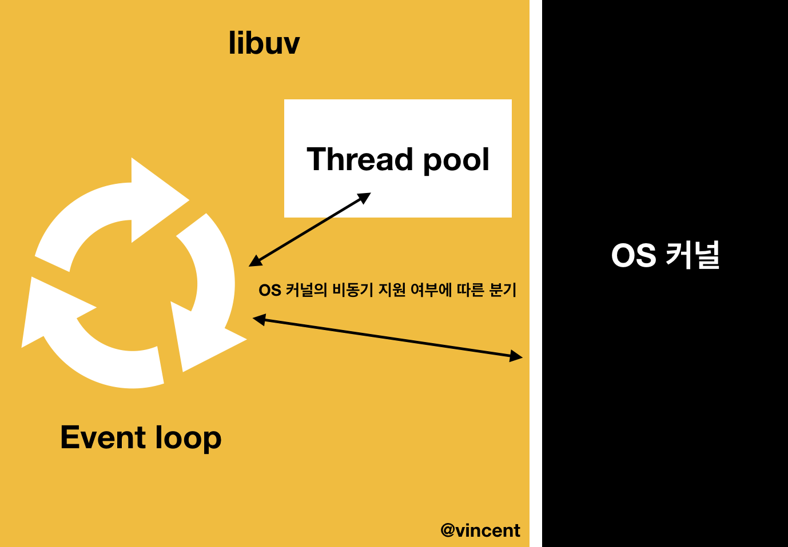

> 아래 참고자료의 글들을 복사해서 정리한 수준이다. 다시 이해하고 정리할 필요가 있다.

# NodeJs의 내부 동작 원리

> libuv, 이벤트루프, 워커쓰레드, 비동기, 이벤트 기반, 논블로킹,싱글 스레드

javascript의 동작원리에 대한 사전지식이 필요하다.

📌 목차

1. NodeJs 란?
2. NodeJs 구성
3. 이벤트 루프란?
4. NodeJs의 비동기 처리

# NodeJs란?

> 비동기 이벤트 주도 JavaScript 런타임으로써 Node.js 는 확장성 있는 네트워크 애플리케이션을 만들 수 있도록 설계된 언어다.

자세한 내용은 목차의 `NodeJS란?` 에 참고하기.

# NodeJS 구성

Node.js를 크게 나눠봤을 때, `내장 라이브러리`와 `v8엔진` 그리고 `libuv`로 구성되어 있다. Node.js의 특성인 이벤트 기반, 논블로킹 I/O 모델들은 모두 libuv 라이브러리에서 구현된다.



# libuv

libuv란 node.js에서 사용하는 `비동기 I/O 라이브러리`다. node.js의 특성인 이벤트 기반, `논 블로킹 I/O 모델`은 모두 libuv에서 구현된다. 콜백 함수들은 libuv 내에 위치한 `이벤트 루프`에서 관리 및 처리된다.

주요특징을 요약하면 다음과 같다.

- `libuv`는 운영체제의 커널을 추상화해서 비동기 API를 지원한다.
- `libuv`는 커널이 어떤 비동기 API를 지원하고 있는지 알고 있다.
- 만약 커널이 지원하는 비동기 작업을 `libuv`에게 요청하면 `libuv`는 대신 커널에게 이 작업을 비동기적으로 요청해준다.
- 만약 커널이 지원하지 않는 비동기 작업을 `libuv`에게 요청하면 `libuv`는 내부에 가지고있는 스레드 풀에게 이 작업을 요청해준다.
- `libuv`는 기본적으로 4개의 스레드를 가지는 스레드 풀을 생성한다

### 이벤트 기반이란?

- node.js는 콜 스택, 이벤트 큐에 항상 명령을 대기시키지 않고 이벤트 리스너event listener를 통해`이벤트가 발생하면 콜백함수를 실행하는 방식`을 사용한다.
- 이벤트가 발생할 때 미리 지정해둔 작업을 수행하는 방식을 의미한다. Node.js는 이벤트 리스너에 등록해둔 콜백함수를 실행하는 방식으로 동작. (흔히 사용하고 있는`router도 이벤트 기반`으로 동작)

### 논 블로킹 I/O이란?

- Node.js는 싱글스레드 논블로킹 모델로 구성되어 있다. 하나의 스레드로 동작하지만, 비동기 I/O 작업을 통해 요청들을 서로 블로킹하지 않다. 즉, 동시에 많은 요청들을 비동기로 수행함으로써 싱글스레드일지라도 논블로킹이 가능하다.
- Input과 Output이 관련된 작업(http, Database CRUD, third party api, filesystem) 등의 블로킹 작업들을 백그라운드에서 수행하고, 이를 비동기 콜백함수로 이벤트 루프에 전달한다.
- 백그라운드: OperatingSystem 커널 혹은 libuv의 스레드 풀



# 이벤트 루프란?

`이벤트에 따라 호출되는 콜백함수를 관리`하는 것이 바로 이벤트 루프다. 이벤트 루프는 여러 개의 `페이즈(Phase)`들을 갖고 있으며 각 phase 들은 `FIFO 큐`를 가지고 있으며, 이 큐에는 특정 이벤트의 콜백들을 넣고, CPU가 할당(=이벤트루프가 해당 phase를 호출할때)될 때 실행한다.

이벤트 루프는 `라운드 로빈(round-robin)` 방식으로 노드 프로세스가 종료될때까지 일정 규칙에 따라 `여러개의 페이즈들을 계속 순회`한다.

> 아래는 Node.js 공식 홈페이지에 나와 있는 로빈 프로세스 스케줄링에 대한 설명이다.

그룹 내에 있는 모든 요소들을 합리적인 순서에 입각하여 뽑는 방법으로서, 대개 리스트의 맨 위에서 아래로 가며 하나 씩 뽑고, 끝나면 다시 맨 위로 돌아가는 식으로 진행된다. 쉽게 말해 라운드 로빈은 “기회를 차례대로 받기”라고 이해해도 좋을 것이다. 컴퓨터 운영에서, 컴퓨터 자원을 사용할 수 있는 기회를 프로그램 프로세스들에게 공정하게 부여하기 위한 한 방법으로서, 각 프로세스에 일정시간을 할당하고, 할당된 시간이 지나면 그 프로세스는 잠시 보류한 뒤 다른 프로세스에게 기회를 주고, 또 그 다음 프로세스에게 하는 식으로, 돌아가며 기회를 부여하는 운영방식이 있는데, 이를 흔히 라운드 로빈 프로세스 스케줄링이라고 부른다.

## 이벤트 루프의 phase들 설명

Node.js가 시작되면 스레드가 생기고, 이벤트 루프가 생성된다. **이벤트 루프는 6개의 페이즈를 라운드 로빈 방식으로 순회하며 동작한다. 각 페이즈는 자신만의 큐를 하나씩 가지고 있다.**

간단하게 요약하자면 다음과 같다.

- **이벤트 루프는 `Node.js`가 비동기 작업을 관리하기 위한 구현체다.**
- **이벤트 루프는 총 6개의 페이즈로 구성되어 있으며 한 페이즈에서 다음 페이즈로 넘어가는 것을 틱이라고 한다.**
- **각 페이즈는 자신만의 큐를 관리한다.**
- **`Node.js`는 순서대로 페이즈를 방문하면서 큐에 쌓인 작업을 하나씩 실행한다.페이즈의 큐에 담긴 작업을 모두 실행하거나 시스템의 실행 한도에 다다르면 `Node.js`는 다음 페이즈로 넘어간다.**
- **이벤트 루프가 살아있는 한 `Node.js`는 이벤트 루프를 반복한다.**

이제 각각의 페이즈들이 세부적으로 어떤 역할을 수행하는지에 알아보자.

```
  ┌───────────────────────────┐
┌─>│ timers │
│ └─────────────┬─────────────┘
│ ┌─────────────┴─────────────┐
│ │ pending callbacks │
│ └─────────────┬─────────────┘
│ ┌─────────────┴─────────────┐
│ │ idle, prepare │
│ └─────────────┬─────────────┘ ┌───────────────┐
│ ┌─────────────┴─────────────┐ │ incoming: │
│ │ poll │<─────┤ connections, │
│ └─────────────┬─────────────┘ │ data, etc. │
│ ┌─────────────┴─────────────┐ └───────────────┘
│ │ check │
│ └─────────────┬─────────────┘
│ ┌─────────────┴─────────────┐
└──┤ close callbacks │
  └───────────────────────────┘
```

### `timers`

setTimeout, setInterval 같은 timer 함수들이 처리된다. **이벤트 루프가 페이즈를 순회하면서 timer 단계에 오면 처리할 수 있는 timer 함수들을 확인하고 콜백함수를 실행한다**. `timer 함수의 입력된 지연시간`은 콜백함수가 실행되는 정확한 값이 아닌, 단지 해당 지연시간 이후에 실행된다는 의미다.

따라서, 타이머 콜백은 지정된 시간이 경과한 후 예약할 수 있는 한 빨리 실행한다. 내부로직은 poll큐에 먼저 등록된 콜백들이 처리되고 실행된다.

### `pending callbacks`(I/O callbacks)

pending queue에 담겨 있는 콜백들을 관리한다. **이 큐에 담기는 콜백들은 이전 이벤트 루프 반복에서 수행되지 못했던 I/O 콜백들이다**. 시스템의 실행 한도 제한에 의해 큐에 쌓인 모든 작업을 실행하지 못하고 다음 페이즈로 넘어갈 수도 있다. 이때 처리하지 못하고 넘어간 작업들을 쌓아놓고 실행하는 페이즈다.

I/O 작업이 완료되면 다음번 루프에 이 단계에 들어와있게 되고, I/O 작업 블록내의 콜백함수들을 **poll 단계의 큐로 넘겨줍니다**

### `idle, prepare`

내부적으로만 사용하므로 생략

### `poll`

> I/O를 얼마나 오래 블록하고 폴링해야하는지 계산하고, poll 큐에 있는 이벤트를 처리한다.

poll 단계는 새 I/O이벤트 검색하고. i/O관련 콜백(close 콜백, 타이머로 스케줄링된 콜백,setImmediate()를 제외한 거의 모든 콜백) 실행한다. 예를 들어, 다음과 같은 콜백들이 실행된다.

- 데이터베이스에 쿼리를 보낸 후 결과가 왔을 때 실행되는 콜백
- HTTP 요청을 보낸 후 응답이 왔을 때 실행되는 콜백
- 파일을 비동기로 읽고 다 읽었을 때 실행되는 콜백

poll phase는 다음과 같은 방법으로 콜백을 관리한다.

- **\*poll** 큐가 **비어있지 않다면\*** 이벤트 루프가 콜백의 큐를 순회하면서 큐를 다 소진하거나 시스템 의존적인 하드 한계에 도달할 때까지 동기로 콜백을 실행합니다.
- **\*poll** 큐가 **비어있다면\*** 다음 중 하나의 상황이 발생합니다.
  - 스크립트가 `setImmediate()`로 스케줄링되었다면 이벤트 루프는 **poll** 단계를 종료하고 스케줄링된 스크립트를 실행하기 위해 **check** 단계로 넘어갑니다.
  - 스크립트가 `setImmediate()`로 스케줄링되지 않았다면 이벤트 루프는 콜백이 큐에 추가되기를 기다린 후 즉시 실행합니다.

**poll** 큐가 일단 비게 되면 타이머가 *시간 임계점에 도달했는지* 확인할 것이다. 만약, 하나 이상의 타이머가 준비되었다면 이벤트 루프는 타이머의 콜백을 실행하기 위해 **timers** 단계로 돌아간다.

### `check`

> **poll** 단계가 완료된 직후 사람이 콜백을 실행할 수 있게 한다.

**`Poll phase`**가 지나면 이벤트 루프는 바로 **`setImmediate()`**API의 콜백과 관련이 있는 **`Check phase`**
에 들어서게 된다. 이 페이즈에서는 다른 페이즈와 마찬가지로 큐가 비거나 시스템 실행 한도 초과에 도달할 때까지 계속 해서 **`setImmediate`**의 콜백들을 실행한다.

### `close callbacks`

close 이벤트에 따른 콜백함수를 실행한다. `socket.on('close', ...)` 이벤트에 따른 콜백함수를 예로 들 수 있다.

## 예시

```jsx
fs.readFile('my-file-path.txt', () => {
  setTimeout(() => {
    console.log('setTimeout');
  }, 0);
  setImmediate(() => {
    console.log('setImmediate');
  });
});
```

- fs.readFile 라는 블로킹작업을 만난 시점에 이벤트루프는 워커쓰레드에게 작업을 넘김
- 워크쓰레드가 작업을 완료한 뒤 I/O callbacks 영역의 큐에 콜백을 등록
- 이벤트루프가 I/O callbacks 영역을 실행할 때, 콜백을 poll 영역의 큐에 등록
- 이벤트루프가 poll 영역을 실행할 때, 큐에 1개가 있으므로 이걸 실행함.
- (콜백내부) 2라인에서 setTimeout() 이므로 다시 timers 영역에 넣고 5라인으로 간다.
- (콜백내부) 5라인에서 setImmediate() 이므로 check 영역에 넣는다.
- 이벤트루프가 poll 큐를 비우고, 다음 실행영역인 check 영역으로 간다. check 영역의 큐에는 들어있는 ’B’를 콘솔에 찍는다. check 영역의 큐를 비우고 다시 while문의 시작지점으로 간다.
- 이벤트루프가 timers 영역을 호출한다. uv\_\_run_timers()는 setTimeout()의 콜백을 poll큐에 등록한다.
- 이벤트루프가 2번째로 poll 영역을 실행한다. 큐에 1개가 있으므로 이걸 실행하고 ’A’를 찍는다.
- node 프로세스가 반환되고 끝

## nodejs의 올바른 사용

따라서, 처리 작업이 cpu를 많이 소모하거나, 대용량 파일을 처리한다면 Node.js에서는 큰 약점이다. 그러나 `IO작업이 별로 없는 어플리캐이션`이나 `단위 작업이 짧은 메시징 어플리캐이션`의 경우 고성능을 보장한다.

### ✅ Node는 동기보다 비동기 방식에 익숙해져야 한다.

## 비동기 프로그래밍 기본

1. 비동기 API 사용

- 비동기 이벤트 발생시키고 완료 여부를 알 수 있는 callback 정의

1. 동기 -> 비동기 전환

```jsx
// 동기
const fs = require('fs');
let filenames = fs.readdirSync('.');
for (let i = 0; i < filenames.length; i++) {
  console.log(filenames[i]);
}
console.log('ready');
console.log('cna prorcess next job...');
// 출력결과
// for문의 console.log
// ready
// cna prorcess next job...

// 비동기
const fs = require('fs');
fs.readdir('.', function (err, filenames) {
  for (let i = 0; i < filenames.length; i++) {
    console.log(filenames[i]);
  }
});
console.log('ready');
console.log('cna prorcess next job...');
// 출력결과
// cna prorcess next job...
// for문의 console.log
// ready
```

1. 비동기 프로그램에서 순차처리

- 중첩된 callback을 활용하여 순서가 보장되게 만들기
- 하지만 과도하게 사용하면 코드의 가독성이 떨어지므로 `async` 모듈 사용

## Node.js의 병렬처리

비동기 방식이라도 Evnet Loop에서 처리되는 작업이 긴 시간을 요구할 때는 성능이 저하될 수 있다. 이를 해결 하기 위해 `이벤트를 잘게 쪼개어 병렬 처리`해야한다.

중첩된 Callback 함수를 `Closure`로 사용하여 자신의 Scope 뿐만 아니라 외부 함수의 Scope를 가지게한다. 예를 들어, `count`변수를 두어 하나의 작업을 병렬처리하여 언제 전체 작업이 완료되는지 알 수 없을 때, `callback이 전달된 횟수만큼 count에 저장`하고 `작업 완료될 때마다 count를 하나씩 감소하게 한다.`. count가 0이되면 모든 작업 완료되었다는 의미로 간주한다.

## Callback의 호출시점

`Callback의 시점을 다른 코드와 같이 순차적으로 생각하면 안 된다`. -> 동기적으로 생각하면 안된다는 뜻❗

예로 들어, 코드상의 Callback로직은 가운데 위치하지만 Runtime에 들어가면 외부 로직과 Callback은 Event Loop에 의해 처리되어 어느 것이 먼저 실행될지 알 수 없다.

## 구체적인 과정

1. 코드가 호출 스택에 쌓인 후 실행하되 그것이 비동기 작업이라면 이벤트 루프는 비동기 작업을 위임한다.
2. Node를 구성하는 libuv는 해당 비동기 작업이 OS커널에서 할 수 있는 것인지, 아닌지(thead pool에서 처리)를 판단하여 비동기 함수를 처리한다.
3. 비동기 작업을 처리하고 콜백 함수를 이벤트 루프를 통해 태스크 큐에 넘겨주준다.
4. 이벤트 루프는 콜스택에 쌓여있는 함수가 없을 때에, 태스크 큐에서 대기하고 있던 콜백함수를 콜스택으로 넘겨준다.
5. 콜스택에 쌓인 콜백함수가 실행되고, 콜스택에서 제거된다.

### 참고자료

[https://github.com/nodejs/node](https://github.com/nodejs/node)

[https://evan-moon.github.io/2019/08/01/nodejs-event-loop-workflow/](https://evan-moon.github.io/2019/08/01/nodejs-event-loop-workflow/)

[https://medium.com/@vdongbin/node-js-동작원리-single-thread-event-driven-non-blocking-i-o-event-loop-ce97e58a8e21](https://medium.com/@vdongbin/node-js-%EB%8F%99%EC%9E%91%EC%9B%90%EB%A6%AC-single-thread-event-driven-non-blocking-i-o-event-loop-ce97e58a8e21)

[https://nodejs.org/ko/docs/guides/event-loop-timers-and-nexttick/](https://nodejs.org/ko/docs/guides/event-loop-timers-and-nexttick/)

[https://www.korecmblog.com/node-js-event-loop/](https://www.korecmblog.com/node-js-event-loop/)

[https://medium.com/the-node-js-collection/what-you-should-know-to-really-understand-the-node-js-event-loop-and-its-metrics-c4907b19da4c](https://medium.com/the-node-js-collection/what-you-should-know-to-really-understand-the-node-js-event-loop-and-its-metrics-c4907b19da4c)
