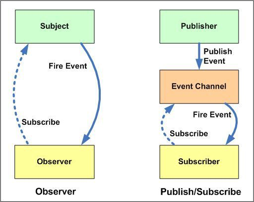

# Publish-Subscribe 패턴

웹 애플리케이션(웹 앱)은 선형적으로 동작하는 일이 거의 없다. 어떤 웹 앱이든 많은 액션은 갑자기 혹은 기대하지 않았을 때 자발적으로 발생한다.

앱은 네트워크 이벤트, 사용자의 조작, 타이밍이 설정된 동작 등 여러 종류의 비동기적인 동작에 적절하게 응답해야 한다. 이 때 중요한 개념이 `비동기`와 `경합상태`다.

자바스크립트 함수가 가진 특징을 활용하기 - 일급 객체

- 어떤 함수도 변수로 할당할 수 있고,
- 다른 함수의 인자로 넘길 수 있음.

addEventListiner를 활용한 예시

`element.addEventListner(type, listener)`  구조에서 addEventListner는 subscriber가 되고, listener는 publicher라고 할 수 있나? 특정 이벤트에 어떤 함수를 구독하도록 만들고, DOM요소에 의해 액션이 발행되면 그 함수가 호출 되는 형태.

이와 같은 관점에서 promise도 설명가능. 우리가 미뤄둔 특정 액션이 완료되면 구독할 수 있게 하고, 데이터가 준비되면 발행하기

fetch api는 특정한 네트워크 액션을 구독,

리덕스? 스토어의 변화를 구독,

## 옵저버 패턴과 차이

> 가장 큰 차이점은 중간에 `Message Broker` 또는 `Event Bus`가 존재하는지 여부
> Observer패턴은 Observer와 Subject가 서로를 인지하지만 Pub-Sub패턴의 경우 서로를 전혀 몰라도 상관없음

- 옵저버 패턴에서 옵저버는 주체를 인식하고 주체는 옵저버의 기록을 유지 관리합니다. 반면 Publisher/Subscriber에서는 게시자와 구독자가 서로 알 필요가 없습니다. 그들은 단순히 메시지 대기열이나 브로커의 도움으로 통신합니다.
- 게시자/구독자 패턴에서 구성 요소는 관찰자 패턴과 달리 느슨하게 결합됩니다.
- 관찰자 패턴은 대부분 동기 방식으로 구현됩니다. 즉, 주제는 일부 이벤트가 발생할 때 모든 관찰자의 적절한 메서드를 호출합니다. 게시자/구독자 패턴은 대부분 비동기 방식으로 구현됩니다(메시지 대기열 사용).
- 옵저버 패턴은 단일 애플리케이션 주소 공간에서 구현되어야 합니다. 반면 게시자/구독자 패턴은 애플리케이션 간 패턴에 가깝습니다.

## 🔍 참고자료

> \[번역\] 초보 프론트엔드 개발자들을 위한 Pub-Sub(Publish-Subscribe) 패턴을 알아보기 - [rinae's devlog](https://www.rinae.dev/)  
> [Observer패턴과 Publisher/Subscriber 패턴의 차이점 - jistol.github.io](https://jistol.github.io/software%20engineering/2018/04/11/observer-pubsub-pattern/)
